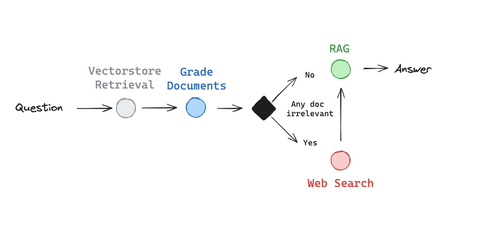

# Corrective RAG (CRAG) using Langchain, Langgraph & OpenAI

[Corrective RAG (CRAG)](https://arxiv.org/abs/2401.15884) is an innovative strategy for Retrieval-Augmented Generation (RAG) that integrates self-reflection and self-grading mechanisms to enhance the quality of generated responses. By evaluating the relevance of retrieved documents, CRAG dynamically refines the information pipeline to correct or supplement data before generation.

---

## Table of Contents

- [Overview](#overview)
- [Pipeline Architecture](#pipeline-architecture)
- [Features](#features)
- [Setup](#setup)
  - [Prerequisites](#prerequisites)
  - [Installation](#installation)
  - [Environment Configuration](#environment-configuration)
- [Usage](#usage)
- [Project Structure](#project-structure)
- [Contributing](#contributing)
- [License](#license)
- [References](#references)

---

## Overview

In traditional RAG systems, the retrieval step may include documents that are irrelevant or ambiguous. CRAG addresses this by introducing a self-grading mechanism that:

1. **Evaluates Relevance:** If at least one document exceeds the relevance threshold, the system proceeds to generate an answer.
2. **Supplements Retrieval:** If all documents fall below the threshold or if the grader is unsure, CRAG triggers a web search (using Tavily Search) to supplement the retrieved documents.
3. **Knowledge Refinement (Optional):** Prior to generation, the system can partition documents into “knowledge strips” and filter out irrelevant portions.

In our implementation using LangGraph, we simplify the process by:
- Supplementing retrieval with web search if any documents are marked as irrelevant.
- Skipping the knowledge refinement phase (which can be added as an additional node).

This design offers a robust method to reduce hallucinations and improve response accuracy.  

---

## Pipeline Architecture

The CRAG pipeline follows these steps:

1. **Document Retrieval:** Query the primary datastore and fetch relevant documents.
2. **Relevance Grading:** Each document is evaluated by a grading function that provides a binary score (`yes` or `no`).
3. **Decision Making:**  
   - If at least one document is relevant, proceed to generation.
   - If none are sufficiently relevant, transform the query and perform a web search to obtain additional data.
4. **Generation:** Use the refined set of documents to generate the final answer with GPT-4O Mini.

A simplified diagram might look like this:



*Note: The above diagram is a conceptual representation. For more detailed examples and inspiration, read the complete tutorial.*  

---

## Features

- **Self-Grading Mechanism:** Automatically evaluates the relevance of retrieved documents.
- **Dynamic Data Supplementation:** Leverages web search (via Tavily Search) when the primary data is insufficient.
- **Modular Pipeline:** Built using LangGraph, allowing you to easily add or remove nodes (e.g., knowledge refinement).
- **Optimized Query Transformation:** Rewrites queries to better capture semantic intent when needed.

---

## Setup

### Prerequisites

- **OpenAI API Key:** For accessing GPT-4O Mini.
- **Tavily API Key:** For enabling web search capabilities.
- **Python Environment:** Depending on your chosen integration.

### Installation

Clone the repository and install the necessary dependencies:

```bash
# Cloning Github Repo
git clone https://github.com/yourusername/corrective-rag.git
cd corrective-rag

# Install Dependencies:
pip install -r requirements.txt
```

### Environment Configuration
Create a .env file in the root directory with the following variables:

```bash
OPENAI_API_KEY=your_openai_api_key
TAVILY_API_KEY=your_tavily_api_key
```

# Usage
You can run the CRAG pipeline using the provided scripts:

```bash
# Run the python file
python main.py
```

When you execute the pipeline, it will:

- Retrieve documents relevant to the provided query.
- Grade each document’s relevance.
- Decide whether to directly generate an answer or transform the query and perform a web search.
- Output the final generated answer.


# Project Structure
```bash
corrective-rag/
├── Data/               # PdFiles to be used as knowledgestore
├── Notebooks/          # All Experimental Notebooks
├── src/                # Contains the individual python scripts
├── .env                # Environment variables file
├── gitignore           # Gitignore file
├── README.md           # ReadMe file
└── params.yaml         # Params file
```

# Contributing
Contributions are welcome! If you’d like to improve CRAG, please follow these steps:

1. Fork the repository.
2. Create a new branch (git checkout -b feature-branch).
3. Commit your changes (git commit -m 'Add new feature').
4. Push to your branch (git push origin feature-branch).
5. Open a pull request with a clear description of your changes.

# License
This project is licensed under the MIT License. See the LICENSE file for details.

# References
- **[LangGraph CRAG Tutorial](https://langchain-ai.github.io/langgraphjs/tutorials/rag/langgraph_crag/)**: An in-depth guide on implementing Corrective RAG using LangGraph.
- **[CRAG Inspiration](https://github.com/langchain-ai/langgraph/blob/main/examples/rag/langgraph_crag_local.ipynb)**: Additional insights and the conceptual framework are based on recent open-source projects and discussions in the community.